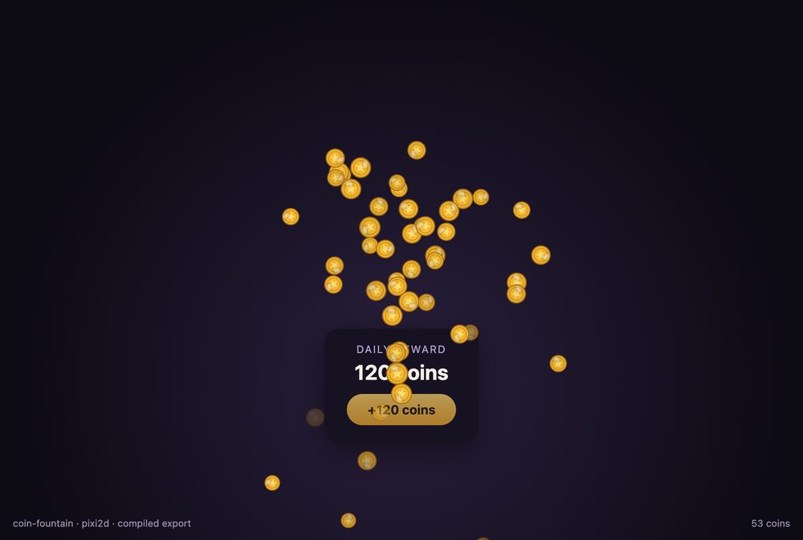

# NixieFX + PixiJS v8 reward coin fountain

A reward popup for a PixiJS v8 game: press **Claim reward** and coins spray up
from the button for 2.4 seconds, spin, fall back and fade. The effect is a
NixieFX project in this folder, so the same JSON can be opened in the NixieFX
editor, a browser-based PixiJS particle editor that also targets Three.js, and
tuned without touching the game code.



## Run locally

```sh
npm install
npm run dev
```

Open the URL printed by Vite. To check the example without a browser:

```sh
npm test            # loads the export, checks assets, determinism, budget and completion
npm run vfx:validate
```

Node.js 20.19 or newer is required by this Vite version.

## Integration map

Everything is in [`src/main.ts`](./src/main.ts):

1. Create a PixiJS v8 `Application` with a transparent background, so the page
   UI shows through and the coins draw above it.
2. Fetch `public/vfx/manifest.json` and the effect JSON, then load them with
   `loadVfxExportBundle` for the `pixi2d` backend.
3. Preload the coin texture through a synchronous texture provider. A missing
   file fails here, before anything is spawned.
4. Create one **persistent** `coin-fountain` instance with `autoStart: false`,
   then call `vfx.draw()` once so `vfx.stats` reports missing textures,
   materials or unsupported modules before the button is enabled.
5. On **Claim reward**, call `spawn()`, which restarts the instance. The
   emitter is authored as a 2.4-second one-shot, so the coins already in the
   air finish their arc and the button re-enables when `isActive` turns
   false, about 4.6 seconds after the click.
6. Advance the renderer once per Pixi ticker frame with
   `vfx.update(ticker.deltaMS / 1000)`, and rebuild the 2D projection on
   resize so the fountain stays anchored to the button.

Do not end the fountain with `stop()` on the Pixi backend: it clears every
live coin in the same frame. Let the authored duration end the emission.

The button and the reward card are plain DOM. Only the coins are drawn by Pixi.
How the bundle, texture provider and ticker fit together is explained step by
step in the [PixiJS particle effects tutorial](https://nixiefx.com/pixijs-particle-effects/).

## Effect files

| Path | What it is |
| --- | --- |
| `vfx-editor.prj` | Project settings: effects in `effects/`, assets in `assets/`, export to `public/vfx` |
| `effects/coin-fountain.json` | Authored source (profile `pixi-ui-2d`) |
| `assets/textures/coin.png` | 64×64 coin sprite drawn for this example |
| `public/vfx/` | Compiled export the game loads. Regenerate it with `npm run vfx:export` |

The effect is one emitter that runs for 2.4 seconds: 26 coins per second,
launched upward with a random horizontal spread, pulled back down by gravity,
with a random start angle and spin of up to about 120°/s (2.1 rad/s), a slight
shrink over life and a fade in the last 20%. It started from
`nixie-fx effect create --name "Coin Fountain" --profile pixi-ui-2d` and was
edited as JSON, so open the folder in the editor to judge it visually before
reusing it.

Games consume only `public/vfx`. Never edit those files by hand; change the
source and export again. `npm test` fails if the export is stale.

## What the tests check

- The export loads for `pixi2d` with `requireEveryAsset` checked against the
  files actually in `public/vfx`, and the manifest reports `pixi2d` as
  `supported` with no blockers.
- `textures/coin.png` is present and is a real PNG.
- The committed export matches `effects/coin-fountain.json`.
- The same seed replays identical particle state; a different seed does not.
- A claim peaks at 54 live coins (the test allows 40–64), well under the
  emitter's `maxParticles` of 96.
- A claim finishes on its own: the runner is inactive with no live coins
  before 5.5 seconds, so `stop()` is never needed.

They do not check pixels. The screenshot above is from a headless Chrome run of
this example.

## Limits

- **The coin spins in 2D only.** Rotation is sprite rotation, not a 3D coin
  flip. A flip needs a flipbook texture and the texture sheet animation module.
- **Depth is draw order on Pixi.** The validator notes that `depthTest` and
  `depthInk` export as deterministic 2.5D ordering on the Pixi backend, not
  GPU depth testing. Nothing in this effect depends on depth.
- **One texture, not an atlas.** For a real game, pack the coin into your
  atlas and map `textures/coin.png` to the atlas frame in the texture
  provider.
