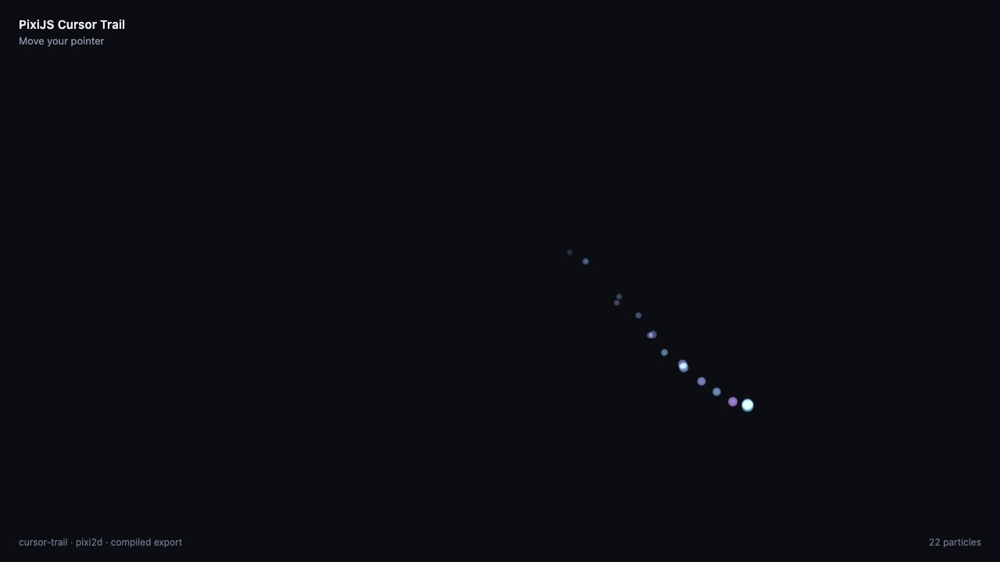

# NixieFX + PixiJS v8 cursor trail

A particle trail that follows the mouse, pen or finger in a PixiJS v8 page.
Moving the pointer leaves a short trail of soft cyan and violet dots that
shrink and fade. When the pointer stops, nothing new is emitted and the trail
is gone within about 0.6 seconds.

The effect is a NixieFX project in this folder. The source effect can be
opened and tuned in NixieFX, a
[pixi js particle editor](https://nixiefx.com/pixijs-particle-effects/), while
the game consumes only the exported runtime bundle.



## Run locally

```sh
npm install
npm run dev
```

Open the URL printed by Vite and move the pointer over the page. Other
scripts:

```sh
npm test             # export, emission, budget, fade-out, strokes, determinism
npm run vfx:validate # nixie-fx validate .
npm run vfx:export   # nixie-fx export . && nixie-fx export-status .
npm run build        # type-check and production build
```

Node.js 22.18 or newer is required. `npm test` imports
[`src/cursor-trail.ts`](./src/cursor-trail.ts) directly, which relies on
Node's built-in TypeScript type stripping.

## How the pointer drives the effect

- **Coordinates.** Pixi's `event.global` is in CSS pixels, the same space as
  `app.screen`, whatever the device pixel ratio. `screenToWorld()` divides by
  24 pixels per world unit and flips Y, because the effect is authored with +Y
  up, as in the editor. `TRAIL_PROJECTION` maps it back with the same origin
  and scale.
- **Resize.** The projection takes no viewport input: its origin is the
  canvas's top-left corner and its scale is fixed. A resize therefore cannot
  move the trail away from the pointer. The renderer's `boundsArea` and the
  stage's `hitArea` are both `app.screen`, which Pixi resizes in place, so the
  page has no resize handler at all.
- **Events.** The stage listens for `pointerdown` and `pointermove`, and only
  the primary pointer draws. Pixi sets `touch-action: none` on the canvas, so
  dragging a finger draws a trail instead of scrolling the page.
- **Strokes.** `pointerleave` fires when the mouse leaves the canvas and after
  a touch lifts or is cancelled. It ends the stroke, as do the window losing
  focus and the tab being hidden, since the pointer can be anywhere when it
  comes back. The next sample then calls `CursorTrail.begin()`. This matters because the effect emits for every unit
  it moves between two updates. Moving it straight to a far
  re-entry point would emit the whole jump at one spot, about 50 particles
  for a 1000 px jump. `begin()` starts a fresh instance at the new point.
  The previous stroke's particles keep fading where they are, and
  `prune()` removes that instance once it is empty.
- **One update per frame.** A single ticker callback calls
  `vfx.update(ticker.deltaMS / 1000)` and then `trail.prune()`. Pixi renders
  afterwards at its own lower priority.

## Rate over distance

The emitter's continuous rate is 0 and its rate over distance is 1.2
particles per world unit: one particle per 20 CSS pixels of pointer travel.
The shared NixieFX simulation measures how far the effect moved since the
previous update and emits that many particles. A still pointer emits nothing,
no matter how long it rests.

The emitter loops so it stays ready for the next movement. Each particle
lives 0.35 to 0.6 seconds and then dies. The number on screen therefore
follows pointer speed: about one live particle per 42 px/s, or around 14
at 600 px/s. `maxParticles` is 128.

## Integration map

Everything is in [`src/main.ts`](./src/main.ts) and
[`src/cursor-trail.ts`](./src/cursor-trail.ts):

1. Create a PixiJS v8 `Application` that resizes to the page.
2. Fetch `public/vfx/manifest.json` and the effect JSON. Load them with
   `loadVfxExportBundle`, requiring the `pixi2d` backend and the
   `cursor-trail` effect.
3. Create the procedural particle textures once with
   `createPixiVfxProceduralTextures()` and pass them to `PixiVfxRenderer`.
   This matters with one instance per stroke: an instance that creates its own
   set does not destroy it, so each stroke would leak five canvas textures.
4. Create `PixiVfxRenderer` under `app.stage` with the fixed trail
   projection. Then create the `CursorTrail`, which owns the effect instances.
5. Fail before accepting input if `vfx.stats` reports missing textures,
   missing materials, or unsupported modules or features.
6. Feed pointer samples to `begin()` and `moveTo()`, and update once per
   ticker frame.
7. Pause the ticker while the tab is hidden. On a `pagehide` that is not
   entering the back/forward cache, remove the listeners and the ticker
   callback, destroy the renderer and the procedural textures, then destroy
   the application.

## Effect files

| Path                        | What it is                                                                           |
| --------------------------- | ------------------------------------------------------------------------------------ |
| `vfx-editor.prj`            | Project settings: effects in `effects/`, assets in `assets/`, export to `public/vfx` |
| `effects/cursor-trail.json` | Authored source (profile `pixi-ui-2d`)                                               |
| `public/vfx/`               | Compiled export the page loads: `manifest.json` and `effects/cursor-trail.json`      |

The effect has no asset files. Its billboard is the runtime's procedural soft
circle, so the manifest's `assets` list is empty and the project has no `assets/`
folder.

The effect is one emitter, with these settings:

- **Spawn:** rate over distance only. Each particle spawns within ±3 px of
  the pointer.
- **Motion:** a slight random drift, mostly upward, slowed by drag.
- **Look:** a start color picked randomly between cyan and violet, additive
  blending, and a size of 17 to 25 px.
- **Over its lifetime:** each particle shrinks to 35% of its start size, and
  its alpha fades from 0.95 to 0.

The effect started from
`nixie-fx effect create --name "Cursor Trail" --profile pixi-ui-2d` and was
edited as JSON.

The page consumes only `public/vfx`. Do not edit those files by hand. Change
the source, then run `npm run vfx:export`. `nixie-fx validate .` reports 0
errors and 0 warnings. It adds two `pixi2d` notes: `depthTest` and `depthInk`
export as 2.5D draw order, not GPU depth testing. Nothing in this effect
depends on depth.

## What the tests check

[`tests/cursor-trail.test.mjs`](./tests/cursor-trail.test.mjs) drives the real
`PixiVfxRenderer` from `nixie-fx/pixi` in Node, through the page's own
`CursorTrail` and projection. It feeds pointer samples, then makes exactly one
update per 60 Hz frame:

- **Export loads.** The export loads for `pixi2d` with `cursor-trail`
  required. The manifest reports `pixi2d` as `supported` with no blockers. It
  declares no assets, and `public/vfx` holds only the effect file.
- **Export is current.** Recompiling `effects/cursor-trail.json` in memory
  with `compileVfxExport` reproduces the committed manifest and effect file
  exactly, so a stale export or a hand edit fails. `compareVfxExportToSources`
  reports nothing stale.
- **Coordinates round-trip.** A pointer pixel maps to world space and back to
  the same pixel.
- **Stationary pointer.** A pointer held still for 3 seconds emits nothing.
- **Movement.** A 600 px sweep emits exactly 30 particles. Every
  particle stays within 14 px of the pointer's path, and the newest one is
  within 20 px of the pointer.
- **Particle budget.** At 600 px/s the steady state stays between 8 and 20
  live particles. A 3000 px/s flick peaks at 40 to 80, below the 128 cap.
- **Fade-out.** After the pointer stops, the trail is empty within the 0.6 s
  maximum lifetime and emits nothing for the next 5 seconds. It still emits
  when the pointer moves again.
- **New strokes.** A new stroke 1000 px away emits nothing for the jump. The
  same jump inside one stroke emits about 50 particles at once. The old
  stroke fades and its instance is removed.
- **Determinism.** The same seed and path replay identical particles, and a
  different seed does not.

Node has no canvas, so the tests use empty textures and do not check pixels.
The DOM event wiring in `src/main.ts` is not covered by these tests; it was
checked in the browser. The repository's root `npm test` does not run them,
so run `npm test` in this folder. The screenshot is from the running page in
headless Google Chrome.

## Limits

- **Density follows pointer speed.** Slow movement leaves a sparse trail and
  fast movement a dense one. Sustained movement faster than about 5000 px/s
  reaches the 128 particle cap. While it is at the cap the runtime drops new particles, so
  the trail thins out instead of growing.
- **Fast movement leaves gaps.** All particles emitted in one frame start at
  that frame's pointer position. During fast movement the trail is a line of
  separate dots, one frame's travel apart. Distance is also measured in a
  straight line between frames, so a curve drawn within one frame counts as
  slightly shorter. A new stroke counts distance from its first update, so
  movement in the frame where it begins emits nothing.
- **Only one finger draws.** Only the primary pointer is tracked. Touch was
  tested with Chrome's touch emulation, not on a physical device.
- **This is a UI-scale example, not a performance benchmark.**
- **A still preview shows nothing.** The effect emits only when its position
  changes, wherever it runs.
- **`billboard.softness` is ignored here.** The Pixi backend draws its
  built-in procedural soft circle and does not read this setting, so it stays
  at the generated default.
- **Validation is not visual review.** Validation and tests do not judge how
  the trail looks. Open the folder in the editor to tune it visually.
