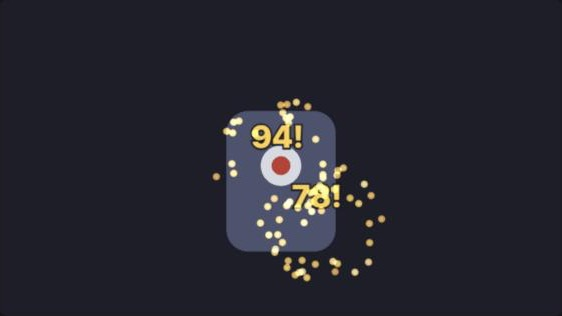

# PixiJS damage number burst

A standalone PixiJS 8 example: hit a target, a damage number floats up and fades, and a NixieFX spark burst plays at the point of impact. Critical hits use a bigger gold number and a bigger burst.



## What's in it

```text
vfx-editor.prj            NixieFX project (open this folder in the editor)
effects/hit-sparks.json   normal hit: 14 sparks, 0.18-0.32 s
effects/crit-burst.json   critical hit: 34 sparks, 0.3-0.55 s, gold
public/vfx/               exported bundle the app loads (generated, don't edit)
src/main.ts               target, damage-number pool, effects, ticker
tests/export.test.mjs     contract tests for the committed export
docs/visual-proof.jpg     screenshot from a local run
```

The effects use the built-in soft billboard, so there are no texture assets to ship. The project's asset root (`assets/`) is empty, so it isn't committed. `nixie-fx validate` and `export` work without it.

## Run

```sh
npm install
npm run dev      # Vite on http://localhost:5173
npm test         # 3 tests
npm run build    # tsc + vite build
```

Click the target for a hit (20% chance of a crit), or use the **Hit** and **Critical hit** buttons.

## Change the effects

Edit `effects/*.json`, or open this folder in the NixieFX editor. Then re-export and re-test:

```sh
npm run vfx:validate   # expect 0 errors, 0 warnings
npm run vfx:export     # writes public/vfx/
npm run vfx:status     # both effects "exported"
npm test
```

The first test fails if `public/vfx/` is out of date with `effects/`, so a forgotten export shows up in CI instead of in the game.

## How it fits together

- **Bundle loading:** `parseVfxExportManifest` reads the manifest, then each listed effect is fetched and passed to `loadVfxExportBundle` with `requiredBackend: "pixi2d"`. Loading throws if either effect is missing or can't run on Pixi.
- **Coordinates:** the renderer uses `createPixiVfx2dProjection({ originX: 0, originY: 0, pixelsPerUnit: 100, yAxis: "down" })`. A Pixi global point `(x, y)` becomes the effect position `[x / 100, y / 100, 0]`.
- **Damage numbers:** these are plain Pixi `Text` objects in a small pool. A hit reuses an inactive one instead of creating and destroying a `Text` every time. The pool only grows when more numbers are on screen at once than it holds.
- **One update per frame:** the ticker moves the numbers, calls `vfx.update(deltaMS / 1000)` once, and removes effect instances whose `isActive` is false (`removeEffect(fx, true)`).

## What I checked

These were run locally with Node 24.3.0, `pixi.js` 8.22.0 and `nixie-fx` 0.1.17:

- `nixie-fx validate .`: 0 errors, 0 warnings. The only notes say depth settings become 2.5D draw order on Pixi.
- `nixie-fx export-status .`: 2 up to date, 0 stale, 0 unexported, 0 orphaned.
- `npm test`: 3 passed. `npm run build`: passed.
- In Chromium: 4 hits, including 1 crit, reused a pool of 4 `Text` objects. About 1.5 s after the last hit there were 0 numbers on screen, 0 live effects and 0 particles.

## Limits

- Damage values are random placeholders. In a game they come from your combat code.
- Text is a canvas `Text`. If many numbers update every frame, `BitmapText` is cheaper.
- Number motion (rise, drift, fade) is a hand-written tween in `main.ts`, not part of the effect.
- Only tested with a mouse in desktop Chromium, not on touch devices.

For the general PixiJS integration path, see the [NixieFX guide to PixiJS particle effects](https://nixiefx.com/pixijs-particle-effects/).
